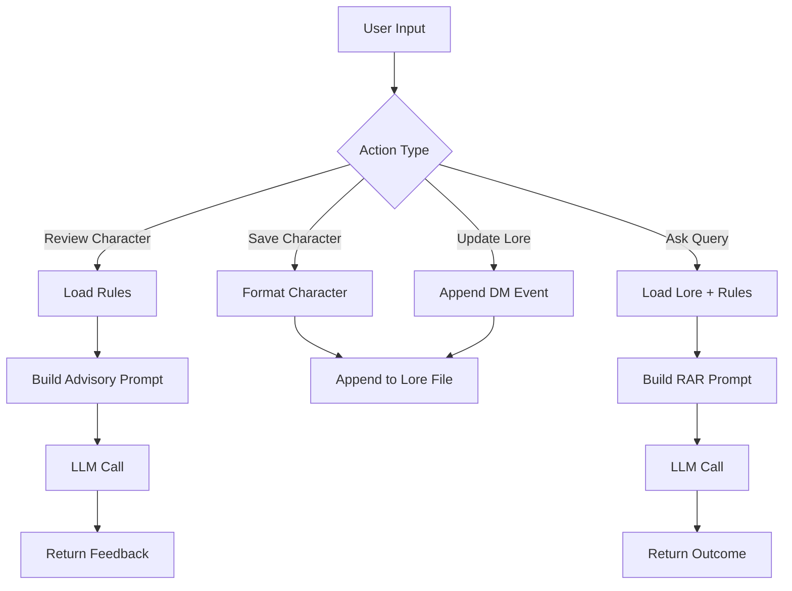

# Honour-N-Hackers

Flask application that integrates a local LLM (Ollama) to:

* Review character sheets
* Persist campaign state (lore)
* Answer gameplay queries using stored context + rules

## Behind the Idea

## Versions and stuff

* Python 3.13.5
* Ollama running locally
  
```bash
pip install flask ollama
ollama pull llama3.2
ollama serve
```

##  Persistence Layer

#### `campaign_lore.txt`

* Acts as **long-term memory**
* Stores:

  * Registered characters
  * DM updates
* Appended continuously (no overwrite)

#### `dnd_rules.txt`

* Static rules context
* Injected into every reasoning prompt

---


## API Endpoints

* **GET /** : Home page (loads lore)

* **GET /create** : Character creation page

* **POST /api/review_char** : Review character and return suggestions

* **POST /api/save_char** : Save character to lore

* **POST /api/update_lore** : Append DM event to lore

* **POST /api/ask** : Generate outcome using lore + rules + dice

---
**Flow**

1. Format character → structured text
2. Append to `campaign_lore.txt`
3. Return success

---

### `/api/update_lore` (POST)

**Input**

```json
{
  "event": "..."
}
```

**Flow**

1. Append `[DM UPDATE]` entry to lore
2. Return success

---

### `/api/ask` (POST)

**Input**

```json
{
  "query": "...",
  "dice": 10
}
```

**Flow**

1. Load:

   * Lore (full history)
   * Rules
2. Construct RAR prompt
3. Send to model
4. Return generated response

---

## Workflow




## Credits

---
