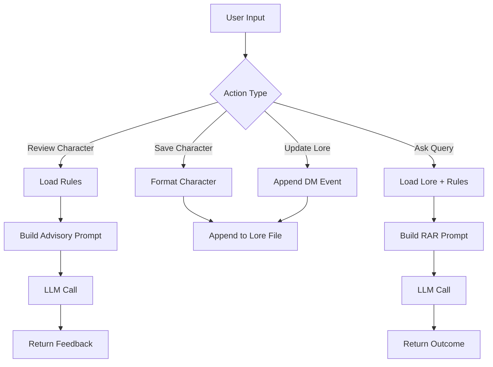

# Honour-N-Hackers

Flask application that integrates a local LLM (Ollama) to:

* Review character sheets
* Persist campaign state (lore)
* Answer gameplay queries using stored context + rules

---

## Requirements

* Python 3.13+
* Ollama running locally

```bash
pip install flask ollama
ollama pull llama3.2
ollama serve
```

---

## Setup

```bash
python app.py
```

Runs on:

```
http://localhost:5000
```

Auto-created files:

* `campaign_lore.txt` → persistent state
* `dnd_rules.txt` → rules injected into prompts

---

## Components

### 1. Persistence Layer

#### `campaign_lore.txt`

* Acts as **long-term memory**
* Stores:

  * Registered characters
  * DM updates
* Appended continuously (no overwrite)

#### `dnd_rules.txt`

* Static rules context
* Injected into every reasoning prompt

---

### 2. Prompt Construction

#### Character Review Prompt

* Role: *Advisor*
* Inputs:

  * Rules
  * Character sheet
* Output:

  * 3–4 bullet suggestions
* Focus:

  * HP / AC sanity
  * Lore consistency

---

#### RAR Prompt (Retrieval Augmented Reasoning)

* Inputs:

  * Full lore (all past state)
  * Rules
  * Dice value
  * User query
* Structure:

  * Context (lore)
  * Mechanics (rules)
  * Action (query + dice)
* Output:

  * Reasoning + outcome

---

### 3. AI Execution

```python
ollama.generate(model=MODEL, prompt=...)
```

* Stateless per call
* Context entirely provided via prompt
* No memory outside files

---

### 4. Formatting Layer

Character data is transformed into a structured block before storage:

```
[CHARACTER REGISTERED]
NAME: ...
VITALS: HP:... | AC:...
STATS: ...
...
----------------------------------------------
```

Purpose:

* Makes lore readable
* Improves retrieval quality inside prompts

---

### 5. File Access Utility

```python
get_file_content(path)
```

* Safe read
* Returns empty string if missing
* Prevents runtime errors

---

## Routes

### `/`

* Loads full lore
* Displays current state

---

### `/create`

* Entry point for character creation

---

### `/api/review_char` (POST)

**Input**

```json
{
  "sheet": "<character_data>"
}
```

**Flow**

1. Load rules
2. Construct advisory prompt
3. Send to model
4. Return feedback

---

### `/api/save_char` (POST)

**Input**

```json
{
  "sheet": { ... }
}
```

**Flow**

1. Format character → structured text
2. Append to `campaign_lore.txt`
3. Return success

---

### `/api/update_lore` (POST)

**Input**

```json
{
  "event": "..."
}
```

**Flow**

1. Append `[DM UPDATE]` entry to lore
2. Return success

---

### `/api/ask` (POST)

**Input**

```json
{
  "query": "...",
  "dice": 10
}
```

**Flow**

1. Load:

   * Lore (full history)
   * Rules
2. Construct RAR prompt
3. Send to model
4. Return generated response

---

## Workflow



---

## Key Points

* **Single source of truth:** `campaign_lore.txt`
* **No DB:** file-based persistence
* **Context = prompt:** all reasoning depends on injected text
* **RAR design:** combines memory + rules + input each call
* **Append-only system:** history is never modified, only extended

---

## Run

```bash
pip install flask ollama
ollama pull llama3.2
ollama serve
python app.py
```

---

## Credits

---
